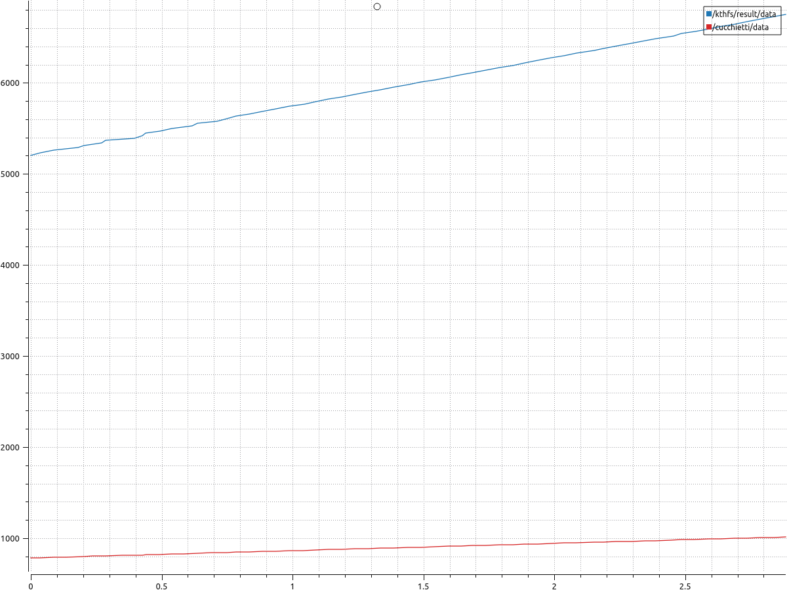
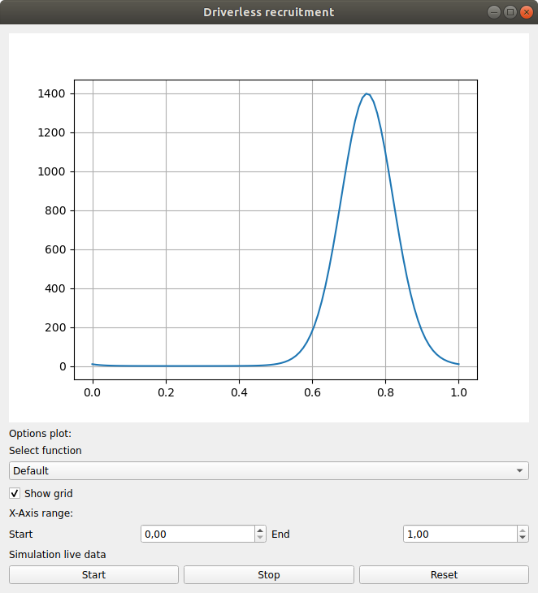

# driverless-recruitment

This repository contains the code developed by Andrea Cucchietti for the Driverless Recruitment 2024.

## Exercise 1
I followed the instructions in the tutorial linked in the description of the exercise. No other dependencies were installed.  
The code of the two packages can be found in `exercise1/`.  

At the end of the exercise, the network was composed of two nodes. The first is the talker.py present in package1, whose only topic is 'cucchietti' and the only subscriber is listener.py in package2. The listener is also a publisher on the topic '/kthfs/result'.    
In addition, PlotJuggler, while opened, subscribes to both topics to plot the output.  
The final situation is described by the following figure obtained with `rqt_graph`.


Snapshot of a plot obtained with PlotJuggler:


## Exercise 2
This exercise was developed in a Miniconda environment on Ubuntu 18.04 with Python 3.11.  
To set up the environment:
```{bash}
conda install jupyter numpy matplotlib scikit-learn scipy pandas
pip3 install pyqt5
```

The final GUI is the following.


The GUI makes possible to switch the function from the default to other two. After the change, the respective boundaries will automatically adapt. 
Furthermore, it is possible to hide the grid and change the boundaries of the plot inside the shown period.  
The buttons in the last row are used to simulate a 'real-time' data visualization. It is possible to start, stop, re-start, and reset the simulation.